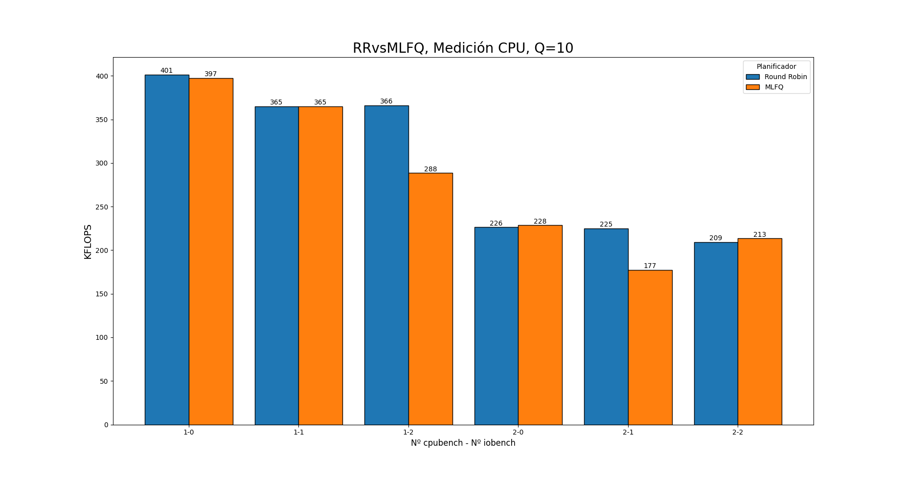
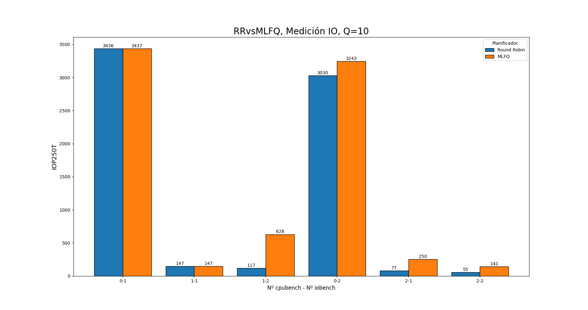
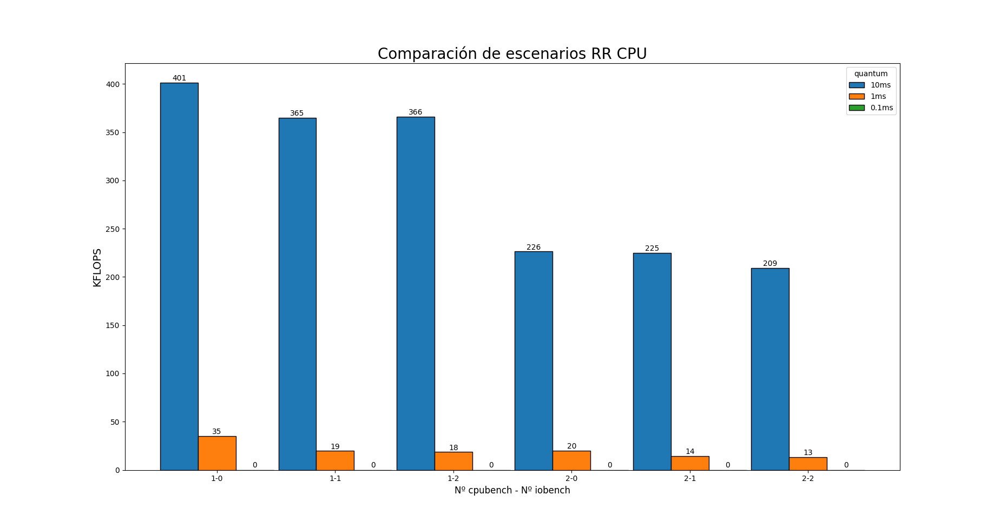
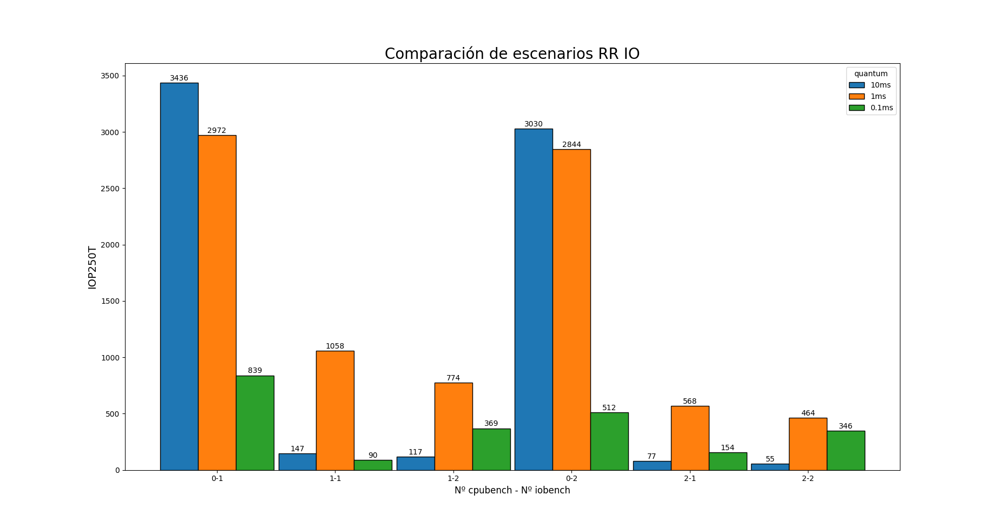
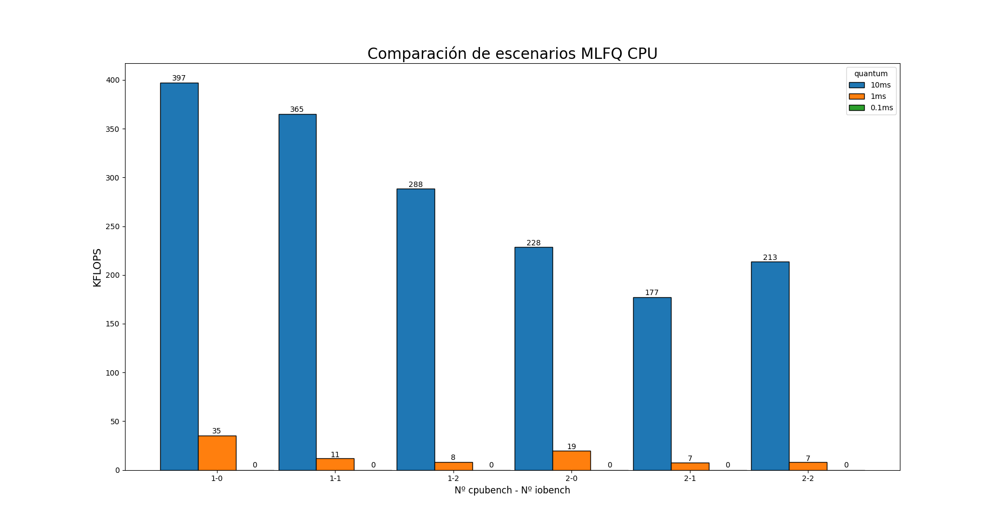
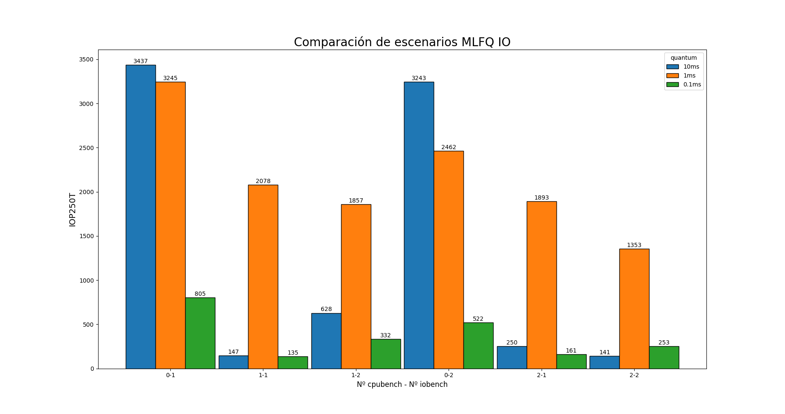

## Introducción:
Manejo del planificador del SO xv6, cambiándolo de Round Robin (RR) a un planificador MultiLevel Feedback Queue (MLFQ) y comparando sus rendimientos.

## Modularización: 

* Código para xv6.
* Código para los gráficos.


## Técnicas de Programación: 

amoldado a la escritura de xv6, tomando la misma cómo referencia, haciendo la excepción de que incluimos mayores comentarios.

Para los gráficos utilizamos python, y librerías que nos facilitaran éso, como ```numpy```y ```matplot```. La programación utilizada en py, es específicamente hecha para resolver el tema de gráficos, no está pensado cómo código duradero ni interesante, sólo cubre una necesidad.

[](https://github.com/psf/black)

## Herramientas de Programación: 

Se utilizó vscode para su desarrollo.

Para extraer los datos se utilizo la redirección de salida:

> make CPUS=1 qemu-nox | tee {salida}.txt

Para correr xv6 con un sólo core:

> make CPUS=1 qemu-nox


## Desarrollo:

La política que utiliza xv6 para su planificador es RR, éste planificador cambia de procesos cada un determinado tiempo, llamado quantum, de esta forma ningun proceso monopoliza en principio la CPU y permite hacer un "paralelismo" de ejecución entre los procesos. 
Para el manejo de la política de procesos xv6 tiene dos criterios para cambiar o elegir cúal es el siguiente proceso:

1. Con las funciones `sleep` y `wakeup`.

    Espera que se complete una operacion de I/O, a un proceso en background o cuando espera con la syscall sleep.

2. Periódicamente tras un quantum.

    Donde el proceso puede terminar antes del quantum, ó ser interrupido por alcanzar el límite del quantum, cuando ésto sucede se ejecutará el siguiente proceso que esté listo, y así hasta finalizar la cola de procesos.
    
    En xv6 el quantum es de 10ms.

Para observar ésto mirar en `proc.c` donde tenemos el scheduler, y para ver el tiempo de duración del quantum, mirar en `lapic.c`. 

se realizo mediciones tanto de io como de cpu para poder hacer comparaciones, usando los programas mencionados más abajo.
Todas las mediciones fueron realizadas cuando aún no estaba implementado el priority boost de nuestro planificador, también siempre fueron realizadas con los mismos escenarios, para que sean lo más comparables posbile.


1 - **Comparativa entre planificador por defecto RR vs MLFQ, con quanto Q = 10ms.**



> En ésta gráfica podemos ver una leve disminución respecto de MLFQ con RR, por lo que pareciera que respecto a CPU es mejor RR. Podemos ver también que RR favorece a los procesos vinculados a CPU con intervalos de tiempo grandes, por eso ésa disminución equitativa en cada barra. Y los procesos de IO podemos ver que no afectan fuertemente al rendimiento, pues en los casos (1-0), (1-1), (1-2) sigue siendo muy parejo. Además recordemos que procesos de IO hacen operaciones de disco por lo que tiene sentido que no afecte el rendimiento, pues en su mayor parte del tiempo están dormidos.



> Luego en ésta gráfica observamos cómo RR decae en las mediciones de IO, y donde en todos los escenarios es mejor MLFQ. Ésto es porque MLFQ les otorga mayor prioridad a los procesos de IO. Notesé la altísima velocidad de respuesta de casos de sólo IO y el gran decaimiento al entrar algún proceso de CPU, pasando de 4347 a 147 IOPT en el caso de RR. Pero vemos cómo en el caso del MLFQ en los casos (1-1),(1-2),(2-1),(2-2) tiene una ventaja muy grande por sobre RR. Pero esta vez el caso (1-1) es un caso particular, pues justamente si MLFQ les otorga mayor prioridad a procesos de IO, entonces deberíamos tenér mayor tiempo de respuesta por tick que con RR.(cómo sucede en el caso (2-2)).


Podemos decir entonces que en un balance general MLFQ es más equilibrado, pues, más allá de que en el primer gráfico decae, no es tan notoria la diferencia, y en el segundo es ampliamente mejor. Pero sigue sufriendo de inanición(starvation), en casos donde constantemente entren procesos de IO nunca se ejecutaría uno de CPU. 

2 - **Comparativa de CPU, con quantums 10ms 1ms 0.1ms**



> Acá podemos ver cómo en RR modificando el quantum un 10% ya decae totalmente el rendimiento de la CPU y con un 100% queda completamente nulo, por lo que con un 1000% probablemente no andaría xv6, lo que mencionábamos al comenzar las comparaciones.

3 - **Comparativa de IO, con quantums 10ms 1ms 0.1ms**



> Podemos ver cómo al reducir un 10% el quantum se obtiene un muy buen rendimiento, ya que ahora los procesos no están la mayor parte del tiempo durmiendo, sino que obtienen un mayor tiempo de respuesta. Pero, siempre hay un pero, y si lo reducimos 100% entonces el tiempo de respuesta será mucho menor, pues ahora sufre las consecuencias del costo de cambio de contexto. Con rendimiento nos referimos a velocidad de lectura y escritura, por ende a un alto nivel de respuesta. 

Observando los datos podemos concluir que un planificador MLFQ es mejor que un RR en operaciones vinculadas a IO. No así con procesos de CPU, pues al no tener priority boost, los mismos pueden sufrir de inanición(starvation)

luego se modific0 la estructura de proc tal como recomienda el enunciado, dejando así la prioridad más alta en el lugar dos y la más baja en el cero.
Para finalizar la consigna, se agrego en `yield` una disminución de la prioridad, y en `sleep` un aumento de prioridad.
Ésto porque cuando un proceso llama a `yield` el quanto ya terminó y en `sleep` se le sube la prioridad ya que deja lo que le queda de quantum.
Además se agregó la impresión de la prioridad en la función `procdump`.

luego se hizo una implementación de MLFQ, , agregando un campo a la estructura `proc` para poder saber la prioridad del proceso, siendo Q2 la prioridad más alta, y Q0 la más baja respectivamente. Las prioridades son de tipo enumerado, por lo que la más baja se corresponde a cero y la más alta a 2.
Una `optimización` para ésto sería utilizar alguna estructura ó algoritmo que reduzca el tiempo de búsqueda y no genere costos de cómputo adicionales, ya que el algoritmo implementado , se basa en buscar el proceso con mayor prioridad para poder ejecutarlo.
No se desarrollara demasiado sobre cómo se implemento ésto pues está bien comentado en el código. (```proc.c```, línea:343).
El priority boost tiene en cuenta cuantos procesos se planificaron en vez de un tiempo determinado.
se tuvo  en cuenta que para crear nuevos procesos se usa fork , por lo que inicializamos todos los procesos hijos con prioridad Q2 (la máxima).
Al igual que en la 3ra parte los procesos suben y bajan de prioridad cuando llaman a `sleep` y `yield`.

2 - **Comparativa de CPU, con quantums 10ms 1ms 0.1ms**



> Acá podemos ver cómo decae totalmente el rendimiento de la CPU cambiando el quantum, ésto ya lo veíamos venir, porque sabemos que MLFQ prioriza procesos de IO. Y cómo mencionamos, los procesos de CPU sufren de inanición.

3 - **Comparativa de IO, con quantums 10ms 1ms 0.1ms**



> Aquí los tiempos de respuesta con el quantum 10% más corto son muchísimo más eficientes que con RR, salvo en los casos (0-1),(0-2), pero de nuevo tenemos el problema de que si el quantum es demasiado chico, por ejemplo 100% más reducido, entonces caemos en lo mencionado anteriormente, y obtenemos un rendimiento casi igual o peor que con RR.

1. RRvsMLFQ, medición de CPU y Q=10.   
> Observemos el caso  (2-2), acá lo que sucede es que el MLFQ le gana a RR... Y nosotros sabemos que MLFQ prioriza operaciones de IO por lo tanto lo que debería pasar en éste caso, es que MLFQ tenga menor KFLOPS que RR por el costo de cambiar prioridades de procesos y elegir estos mismos.

2. MLFQ IO.
> Observemos los casos {(1-1),(1-2),(2-1)}, estos nos presentan algunos cuestionamientos o contradicciones con lo planteado anteriormente. El MLFQ con procesos de IO y con quantum 0.1ms debería tener más tiempo de respuesta por tick que con quantum de 10ms y menos que con 1ms. Menos que con 1ms ya que va a sufrir las consecuencias de los context switch y más que con 10ms ya que el proceso de cpubench va a sufrir de inanición. El caso de (2-1), sería el más claro, porque por más que haya dos CPU y un sólo IO, los procesos de cpu sufrirían inanición por lo que con quantum 0.1ms superaría al de 10ms.[^1]

3. RR IO
> Observemos los casos {(1-1),(1-2),(2-1),(2-2)}, si sólo se ejecutan procesos de IO entonces sí debería suceder que con un quantum corto la medición sea más pequeña que con un quantum largo, pero por ejemplo, vamos al caso (1-1), sabemos que RR trabaja por quantum y no tiene prioridades, entonces con un quantum corto debería tener mayor lecturas y escrituras que con un quantum largo, en los casos mencionados lo que sucede en realidad es que al compartir con procesos de cpu y tener un quantum largo se pierde el rendimiento.[^1]

[^1]: Una posible razón sería que con el quantum tan corto a los procesos iobench se le acabe el quanto antes de que realize operaciones de escritura y lectura a disco, ésto generaría que los procesos pierdan la prioridad.

